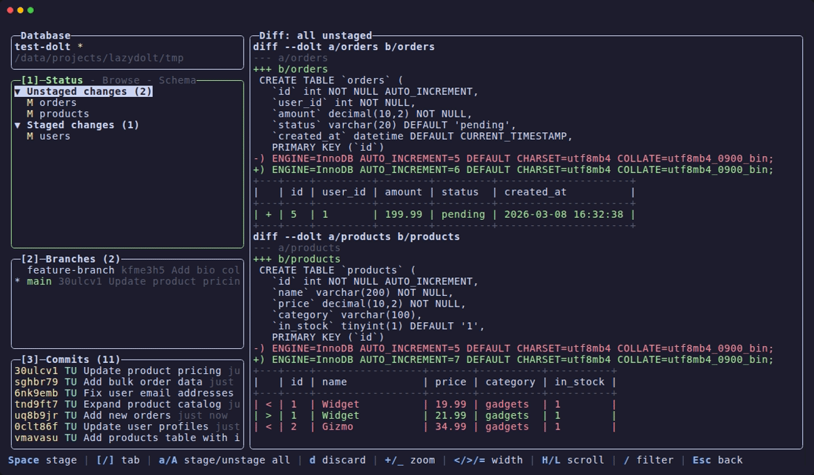

# lazydolt

A terminal UI for [Dolt](https://www.dolthub.com/blog/2021-09-17-dolt/) databases, inspired by [lazygit](https://github.com/jesseduffield/lazygit).

Built with Go using [Bubble Tea](https://github.com/charmbracelet/bubbletea) and [Lip Gloss](https://github.com/charmbracelet/lipgloss).



## Features

- **Table management** — view, stage, unstage, discard, rename, copy, drop, and export tables
- **Branch operations** — checkout, create, rename, merge, rebase, and delete branches
- **Merge conflict resolution** — resolve conflicts with ours/theirs or abort merge
- **Commit history** — browse commits, cherry-pick, revert, amend, and reset
- **Tag management** — create and delete tags at any commit
- **Remote management** — add/delete remotes, push, pull, and fetch
- **Diff viewer** — color-coded diffs with scrolling, diff statistics toggle, and schema diffs
- **Blame view** — view blame output per table
- **Schema viewer** — syntax-highlighted CREATE TABLE statements
- **Table data browser** — paginated, formatted table viewer
- **SQL query panel** — run arbitrary SQL queries with `:` key
- **Query diff** — compare results of two SQL queries with `Q` key (uses `dolt query-diff`)
- **Sort and filter** — sort branches/commits with `s`, filter commits by author/message with `F`
- **Stash support** — stash/pop/drop changes with `S` key
- **Undo/redo** — undo and redo mutations with `z` / `Z` keys
- **Clipboard copy** — copy selected item to clipboard with `y` key
- **Database export** — dump database to SQL/CSV/JSON with `E` key
- **Configuration viewer/editor** — view and edit dolt config with `@` key
- **Reflog** — view reference log with `l` key in commits panel
- **Command log** — persistent log of all dolt CLI commands and errors
- **Search/filter** — filter tables, branches, and commits with `/`
- **Mouse support** — click to focus panels and select items, scroll wheel navigation
- **Zoomable layout** — zoom panels with `+` / `_` keys, adjustable column width with `<` / `>` / `=`
- **Help overlay** — searchable keyboard shortcut reference with `?`

## Requirements

- Go 1.24+
- [Dolt](https://docs.dolthub.com/introduction/installation) installed and on your `PATH`

## Installation

```bash
go install github.com/aspiers/lazydolt/cmd/lazydolt@latest
```

Or build from source:

```bash
git clone https://github.com/aspiers/lazydolt.git
cd lazydolt
go build -o ~/bin/lazydolt ./cmd/lazydolt
```

## Usage

```bash
lazydolt /path/to/dolt/repo
```

## Keyboard Shortcuts

### Global

| Key | Action |
|-----|--------|
| `q` / `Ctrl+C` | Quit |
| `Tab` / `Shift+Tab` | Next / previous panel (1-2-3-main) |
| `1`-`3` | Jump to left panel |
| `c` | Commit |
| `+` / `_` | Zoom panel |
| `<` / `>` | Narrow / widen left column |
| `=` | Reset column width |
| `P` | Push to remote |
| `p` | Pull from remote |
| `f` | Fetch from remote |
| `R` | Refresh all data |
| `S` | Stash changes / show stash list |
| `:` | Run SQL query |
| `Q` | Query diff (compare two queries) |
| `/` | Filter panel items |
| `Esc` | Back / reset zoom / clear filter |
| `z` | Undo last operation |
| `Z` | Redo undone operation |
| `y` | Copy selected item to clipboard |
| `E` | Export database (dump) |
| `@` | View/edit dolt configuration |
| `Ctrl+L` | Redraw screen |
| `?` | Toggle help |

### Tables Panel

| Key | Action |
|-----|--------|
| `j` / `k` | Navigate |
| `Space` | Stage/unstage table |
| `a` | Stage all |
| `A` | Unstage all |
| `d` | Discard changes |
| `O` | Resolve conflicts (ours) |
| `T` | Resolve conflicts (theirs) |
| `X` | Abort merge |
| `s` | View schema |
| `w` | Toggle diff statistics |
| `b` | View blame |
| `o` | Table operations (rename, copy, drop, export) |
| `Enter` | Browse table data |

### Branches Panel

| Key | Action |
|-----|--------|
| `j` / `k` | Navigate |
| `Enter` | View branch commits |
| `Space` | Checkout branch |
| `W` | Diff against current branch |
| `m` | Merge into current |
| `e` | Rebase onto branch |
| `n` | New branch |
| `r` | Rename branch |
| `s` | Sort branches |
| `D` | Delete branch/tag/remote |
| `a` | Add remote |

### Commits Panel

| Key | Action |
|-----|--------|
| `j` / `k` | Navigate |
| `Enter` | View commit details |
| `s` | Sort commits |
| `F` | Filter commits (by author/message) |
| `A` | Amend last commit |
| `g` | Reset to commit |
| `C` | Cherry-pick commit |
| `t` | Revert commit |
| `T` | Create tag at commit |
| `l` | View reflog |

### Main Panel

| Key | Action |
|-----|--------|
| `j` / `k` | Scroll up/down |
| `PgUp` / `PgDn` | Page up/down |
| `u` / `d` | Half page up/down |
| `H` / `L` | Scroll left/right |
| `s` | Toggle schema diff |
| `w` | Toggle diff statistics |

## Architecture

Three layers with strict dependency direction:

- `internal/domain/` — pure types (no imports from other internal packages)
- `internal/dolt/` — CLI wrapper (imports domain only)
- `internal/ui/` — Bubble Tea TUI (imports domain + dolt)

## Development

```bash
# Run tests
go test ./...

# Run static analysis
go vet ./...

# Build
go build -o ~/bin/lazydolt ./cmd/lazydolt

# Re-record the demo GIF (requires vhs: https://github.com/charmbracelet/vhs)
vhs demo.tape
```

## License

[GPL-3.0](LICENSE)
